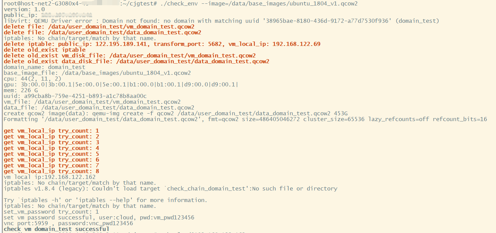
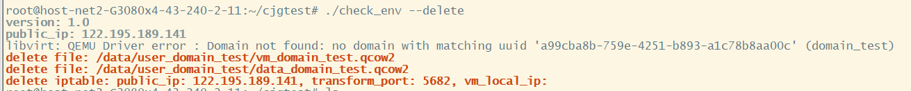

## (一) 安装前准备(基于已配置好固定公网 ip 地址）,部署KVM运行环境

```shell
sudo echo "140.82.114.4 github.com"   >> /etc/hosts
sudo echo "199.232.5.194 github.global.ssl.fastly.net"   >> /etc/hosts
sudo echo "nameserver 8.8.4.4" | sudo tee /etc/resolv.conf > /dev/null
sudo apt-get update
sudo apt-get upgrade -y
sudo apt-get  install qemu-kvm libvirt-clients libvirt-daemon-system bridge-utils virt-manager ovmf cpu-checker vim expect -y
```

## (二) 创建和挂载 XFS 文件系统

**1、查看硬盘分区情况**

`lsblk`

**2、创建数据盘文件夹并且格式化硬盘、挂载硬盘 (数据盘挂载目录必须为/data)**

```shell
sudo mkdir /data
sudo apt-get install xfsprogs -y
sudo mkfs.xfs -n ftype=1 -f /dev/sdb  （此处是否为sdb需要根据lsblk查看情况而定）
sudo mount  -o pquota /dev/sdb /data
sudo chmod 777 /data
sudo echo "/dev/sdb /data     xfs pquota 0 1" >> /etc/fstab
sudo mount -a
```

## (三) 判断机器是否支持虚拟化

**1、开启硬件支持**

> BIOS 开启 VT-d（如果是 AMD 平台，需要开启 AMD-Vi 具体操作根据主板类型浏览器搜索即可）
> VT（VT-x）及 VT-d 支持，AMD 叫 AMD-Vi。需要将相关支持设置为 enable，默认开启
>
> 一般情况下路径：Processor—IIO Configuration—Intel@ VT for Directed I/O(VT-d)

**2、环境依赖，检查 CPU 是否支持虚拟化以及 KVM 是否可用**

`egrep -c '(svm|vm)' /proc/cpuinfo`

> CPU 检测，如果显示为 0，则不支持虚拟化

`kvm-ok`

> 检查 kvm 是否可用
>
> 显示 INFO: /dev/kvm exists
> KVM acceleration can be used
> 表示可以进行后续操作，如果显示与其不相符，请检查 VT-d 是否正确开启

**3、检查 ip_forward 转发是否开启**

> 查看/proc/sys/net/ipv4/ip_forward 是否为 1
> 如果不为 1 则执行:
>
> ```
> sudo sh -c 'echo "net.ipv4.ip_forward=1" >> /etc/sysctl.conf'
> sudo sysctl -p
> ```
>
> 查看 lsmod | grep br_netfilter 是否有输出
> 如果没有输出则执行：
>
> ```
> sudo sh -c 'echo "br_netfilter" > /etc/modules-load.d/br_netfilter.conf'
> ```
>
> 执行完后需要重启，也可以与设置完显卡直通后一起重启

**vfio 环境准备**

- 设置黑名单，使卡不被占用

```shell
sudo vim /etc/modprobe.d/blacklist.conf
#最后添加内容：
blacklist snd_hda_intel
blacklist amd76x_edac
blacklist vga16fb
blacklist nouveau
blacklist rivafb
blacklist nvidiafb
blacklist rivatv
```

- 设置显卡直通

```shell
#查询显卡ID
lspci -nnv | grep NVIDIA
复制显卡id，例如10de:2231、10de:1aef，重复内容仅保留一次即可

#修改内核文件
sudo vim /etc/default/grub
#在GRUB_CMDLINE_LINUX_DEFAULT字段添加（如果是AMD平台，intel_iommu=on改为amd_iommu=on)
quiet splash intel_iommu=on kvm.ignore_msrs=1 vfio-pci.ids=显卡id，中间以逗号隔开
#在GRUB_CMDLINE_LINUX字段添加
quiet splash intel_iommu=on iommu=pt rd.driver.pre=vfio-pci

#更新内核
sudo update-grub

#重启机器
reboot

#查询显卡占用情况
lspci -vv -s <显卡PCI接口,例如00：01.0> | grep driver
```

> 显示 vfio-pci 即为正常，非 vfio-pci 请返回查看 grub 文件是否正确，如果无任何输出，请执行下面的手动绑定

- 检查内核参数：

> 检查`/proc/sys/net/bridge/bridge-nf-call-iptables`和`/proc/sys/net/bridge/bridge-nf-call-ip6tables`是否都=1

**手动绑定 GPU（仅限上一步查询没有输出的情况，以下示例仅作演示请根据实际查询结果进行替换）**

```shell
#执行命令进行绑定(注意：echo后的内容为机器查询到的显卡id）已经被占用的PCI可不用再手动绑定
sudo -i
sudo echo 10de 1e82 > /sys/bus/pci/drivers/vfio-pci/new_id
sudo echo 10de 2206 >> /sys/bus/pci/drivers/vfio-pci/new_id
…………


#绑定完成后再次查询（每张卡的所有项都要查一下）
lspci -vv -s 17:00.0 | grep driver
#如果出现 Kernel driver in use : vfio-pci 说明绑定成功。如果仍未成功，请返回检查
```

## (四) 确认机器显卡被 vfio-pci 占用后，启动 libvirtd 服务并设置开机自启

这一步配置非常重要! **如果没有正确配置将无法正确接收请求，会直接影响机器在链状态，影响出租，造成损失**

**1、开启 virt tcp 监听服务：**

```shell
修改配置文件：
sudo vim /etc/libvirt/libvirtd.conf

找到下边这2行，去掉开头的#号：
#listen_tls = 0
#listen_tcp = 1

找到这一行，去掉开头#号，并且将sasl改为none：
#auth_tcp = "sasl"	======>	auth_tcp = "none"

sudo vim /etc/default/libvirtd
#对应修改为如下配置（这个是小写L）
libvirtd_opts="-l"

#修改完成后请执行：
systemctl mask libvirtd.socket libvirtd-ro.socket libvirtd-admin.socket libvirtd-tls.socket libvirtd-tcp.socket
```

**2、启动 libvirtd 并设置开机自启&检查服务状态**

- sudo systemctl restart libvirtd.service
- sudo systemctl enable libvirtd.service
- systemctl status libvirtd

**3、测试 libvirtd 是否启动成功**

- virsh connect qemu+tcp://localhost:16509/system
- 如果没有输出错误，就说明启动成功了；

## (五) 下载镜像（镜像必须放置于 /data/base_images 目录下）

  - 到镜像存储服务器下载对应的镜像，存放到本地的/data/base_images目录下

## (六) 检测以上的配置是否正确

- 测试程序: compute_node/tools/check_env
- chmod +x compute_node/tools/check_env
- 运行: ./check_env --image <镜像文件的绝对路径>

  例如： ./check_env --image=/data/base_images/ubuntu_1894_v1.qcow2

- 出现绿色 `check vm domain_test successful` 即为成功，若没有出现，请排查前面各项配置是否正确。
- 如果检测成功，会成功创建一个虚拟机，通过 ssh 登陆进入这个虚拟机内部：

  `ssh cloud@<vm_local_ip>`

  其中，vm_local_ip 是虚拟机的内网 ip 地址，用户名是 cloud，pwd 后面的是登陆密码
  

- 检测没有问题后，删除刚才创建的虚拟机：

  运行: ./check_env --delete

  


